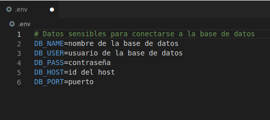
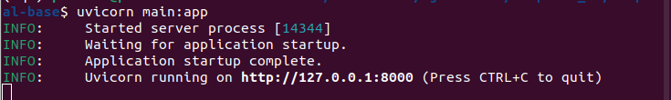
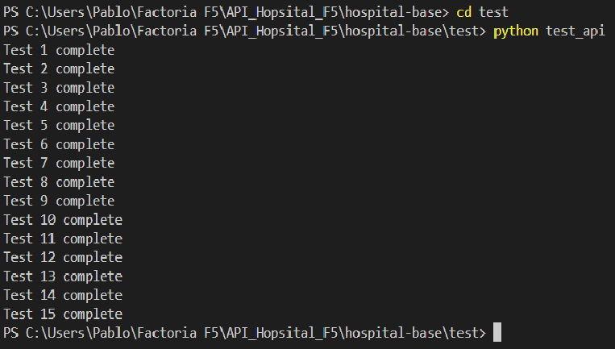
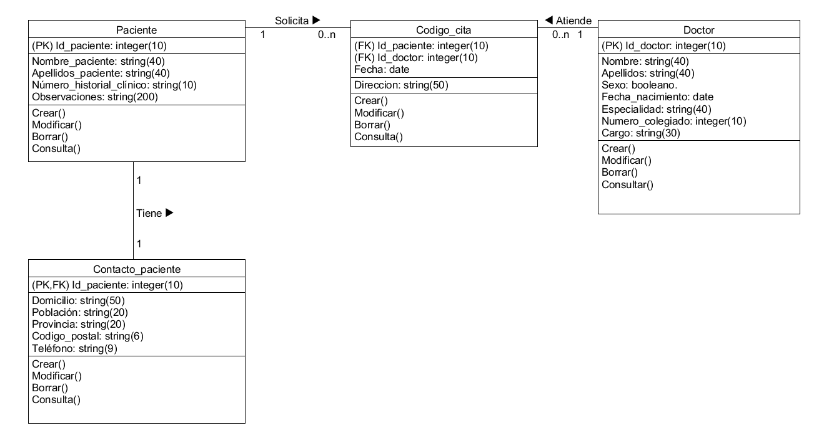

# Hospital F5 API

# Link a la Documentación en Notion https://www.notion.so/Documentaci-n-API-Hospital-F5-cf7d033453bb4e26a2b5c3476f202033

## ***¿Cómo se instala la API?***
1. Crea un entorno específicamente para este proyecto. Por ejemplo con conda 
```
conda create -n nombreEntorno
```
2. Dentro de este entorno será necesario instalar SQLAlchemy , FastAPI, psycopg2 y dotenv:
```
pip install sqlalchemy
pip install fastapi
pip install psycopg2
pip install dotenv
```
3. Descarga el contenido del repositorio https://github.com/Factoria-F5-AI-Bootcamp-1-Edicion/hospital-base.git
4. Solicite los datos de acceso a la base de datos del propietario e introdúzcaos en un archivo **.env** y ponga este archivo en la misma carpeta que el resto de archivos de la API. 
5. Desde la terminal, diríjase a la cArpeta que contiene los archivos de la API y desde allí ejecute
```
uvicorn main:app
```
   Esta terminal debe permanecer abierta para el correcto funcionamiento de la API.

6. En la terminal le aparecerá un mensaje que dirá **Uvicorn running on direcciónDelServidor** 
7. Diríjse a la dirección del servidor dada, se abrirá en su navegador predeterminado.\n 8. A la ruta raíz en la que se encuentra añada /docs, **ejemplo: http://127.0.0.1:8000/docs**
7. En este momento se encuentra en la documentación Swagger de la API, allí encontrará las peticiones que puede hacer al servidor, con su explicación.
8. Comience a consultar, crear, modificar y eliminar los datos de pacientes, doctores, contactos de pacientes y citas.

## ***Otras rutas de interés en la API***

Añadiendo al final de la **direcciónDelServidor** (ejemplo: http://127.0.0.1:8000) estas rutas accederá a diferentes consultas:
```
/pacientes              En esta página podrá consultar los datos de los pacientes disponibles.
/doctores               En esta página podrá consultar los datos de los doctores disponibles.
/contacto_pacientes     En esta página podrá consultar los datos de los contactos disponibles.
/codigo_cita            En esta página podrá consultar los datos de las citas disponibles.
```

## ***Ejecutar el test de la API***

Para comprobar que todo funciona correctamente antes de empezar a realizar consultas a la base de datos con esta API, se recomienda ejecutar el test. Para ello, con la terminal y desde la carpeta raíz donde descargó el contenido del repositorio (por defecto: .../hospital-base) ejecute lo siguiente:
```
python tests/test_api
```
Tras ejecutar ese comando debería aparecer una salida mostrando los test completados como la siguiente:


Si alguno de los 20 tests fallaran habría que revisar el error y arreglar el problema antes de empezar a utilizar la API.


## ***¿Para qué puedo utilizar esta API?***

Esta API le permite al usuario crear, consultar, actualizar y eliminar datos de los pacientes, así como sus datos de contacto y sus citas, y los doctores del Hospital F5.

## ***Esquema UML de las tablas creadas por esta API***

Al ejecutar el programa por primera vez, se crearan en el servidor 4 tablas: paciente, doctor, contacto_paciente y codigo_cita. Estas tablas están relacionadas de la siguiente manera:


## ***Tecnología utilizada***

- Organización: Metodología SCRUM y Trello.com
- Lenguajes utilizados: Python y PostgreSQL.
- Librerías utilizadas: SQLAlchemy, FastAPI, dotenv.
- Documentación: MarkDown y Swagger.

## ***Créditos***

Desarrollado por: 

- Vaneza: Scrum Máster
- Pablo
- Christian: Product Owner
- Nayare

Ejercicio para el bootcamp de Inteligencia Artifical en **Factoría F5**.
> Contacto: hospitalf5@factoriaf5.org 